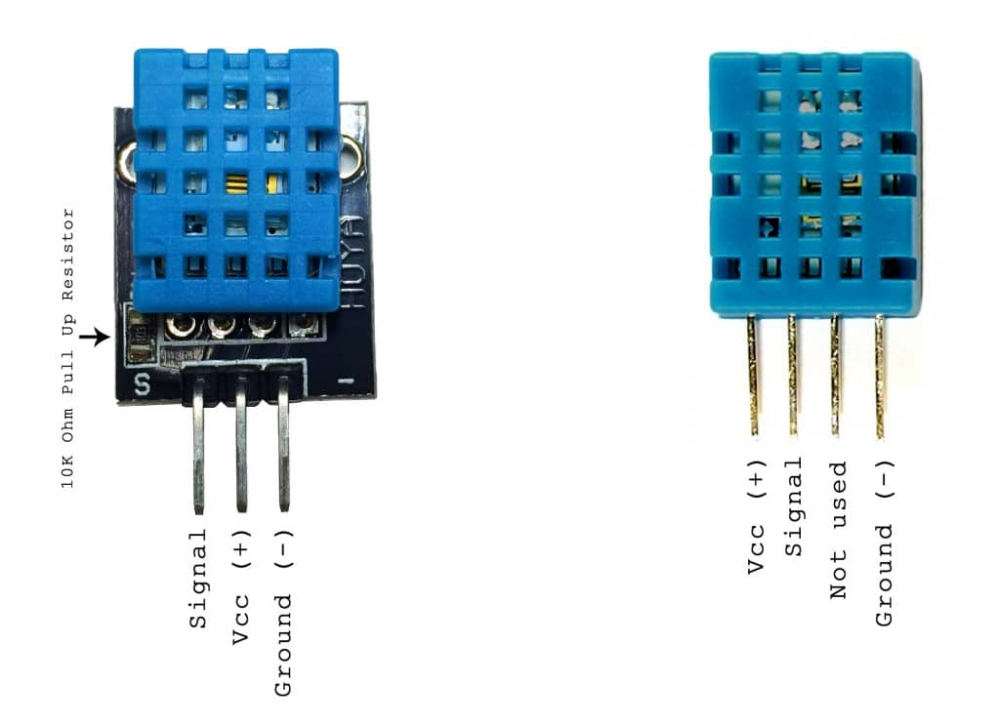

# ttgo_karim

1. Power DHT11 with 5V or 3.3V

2. DHT11 signal pin must be connected to pin 17

# Usage

Welcome to TTGO Display

1. To change for a new SSID, send new ssid then new password from serial window

2. Press left button to toggle between Clock/Wifi scan.

3. Press right button to toggle between Celsius/Fahrenheit. 

 
